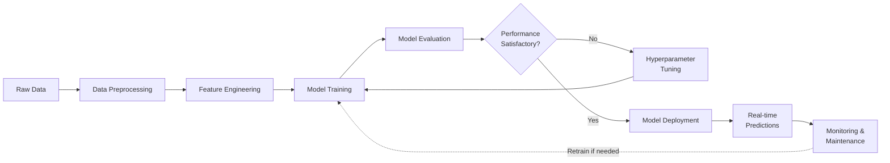

# Advanced Loan Prediction System using Machine Learning

## Overview
The Advanced Loan Prediction System aims to predict whether a loan application will be approved or denied based on various factors like applicant information, financial history, credit score, and loan amount. The goal is to use machine learning techniques to automate loan predictions, improving the efficiency and reliability of the decision-making process.

This project involves data preprocessing, model training, evaluation, and deployment, making it a comprehensive solution for real-world financial applications.

## Project Pipeline


## Key Features

### 1. Data Preprocessing
- **Handling Missing Values**: Missing data is imputed using appropriate statistical methods
- **Encoding Categorical Variables**: Convert categorical data into numerical values using one-hot encoding or label encoding
- **Normalizing Numerical Features**: Numerical features like loan amount and income are normalized to enhance model performance

### 2. Feature Engineering
- **New Feature Creation**: Derive new features from existing ones (e.g., creating a debt-to-income ratio) to boost predictive accuracy
- **Feature Selection**: Identify and retain features that have a significant impact on loan approval

### 3. Model Training
Train various machine learning models, including:
- Logistic Regression
- Decision Trees
- Random Forests
- Gradient Boosting Machines (XGBoost, LightGBM)
- Neural Networks (for advanced modeling)

### 4. Model Evaluation
Evaluate the model's performance using metrics like:
- Accuracy
- Precision
- Recall
- F1-score
- ROC-AUC

Use cross-validation and confusion matrix to ensure model robustness and avoid overfitting.

### 5. Hyperparameter Tuning
Use Grid Search or Random Search to optimize the hyperparameters of models like decision trees, random forests, and boosting algorithms to improve performance.

### 6. Model Deployment
Deploy the final trained model into a production environment (e.g., using Flask or FastAPI) for real-time loan approval predictions.

### 7. Monitoring and Maintenance
Monitor the performance of the deployed model over time and periodically update or retrain the model to ensure its accuracy and effectiveness.

## Project Structure
```
├── data/
│   └── loan_data.csv        # Dataset for training and testing
├── src/
│   ├── preprocess.py        # Script for data preprocessing
│   ├── train.py             # Script for training models
│   └── evaluate.py          # Script for evaluating models
├── models/
│   └── trained_model.pkl    # Serialized trained model
├── app/
│   └── app.py              # Web app for deployment (Flask or FastAPI)
├── README.md               # Project description and instructions
└── requirements.txt        # List of dependencies
```

## Dependencies
To run the project, the following dependencies are required:

- Python 3.x
- pandas: For data manipulation and analysis
- scikit-learn: For machine learning algorithms and model evaluation
- XGBoost or LightGBM: For advanced boosting algorithms
- Flask or FastAPI: For deploying the machine learning model
- numpy: For numerical operations
- matplotlib/seaborn: For visualizations
- joblib: For saving and loading the trained model

You can install all the dependencies by running:
```bash
pip install -r requirements.txt
```

## Usage

### 1. Data Preparation
- Place your dataset (e.g., loan_data.csv) in the data/ directory
- Run the preprocess.py script to clean and preprocess the data:
```bash
python src/preprocess.py
```

### 2. Model Training
Train machine learning models using the train.py script:
```bash
python src/train.py
```

### 3. Model Evaluation
Evaluate the models using the evaluate.py script:
```bash
python src/evaluate.py
```

### 4. Hyperparameter Tuning
Use hyperparameter tuning (included in train.py) to optimize the performance of the best model.

### 5. Model Deployment
Deploy the trained model using Flask or FastAPI:
```bash
python app/app.py
```

### 6. Model Monitoring
Regularly monitor the deployed model's performance, and retrain or update it based on new data if necessary.

## Conclusion
The Advanced Loan Prediction System leverages machine learning to streamline and optimize the loan approval process. The system can be deployed into various environments to handle real-time predictions and continuously improve over time by incorporating new data.
